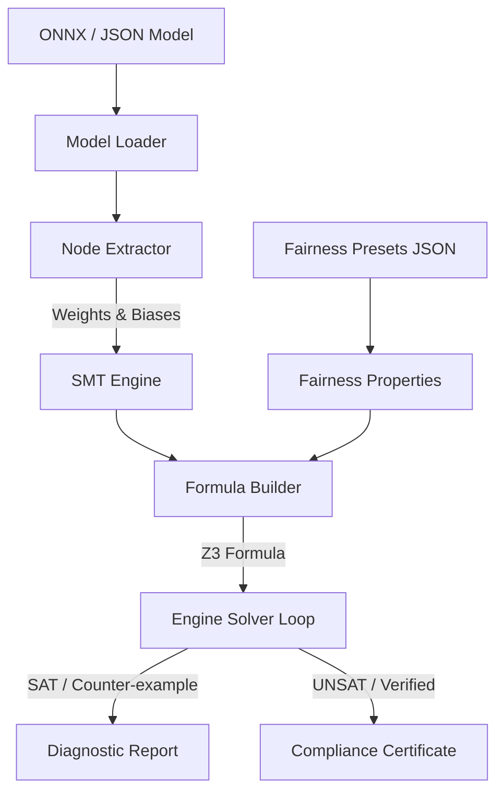

# System Architecture: SMT-Backed ML Fairness Verification Engine

This document provides a technical overview of the architecture, data flow, and functional modules of the Fairness Verification Engine.

## Architectural Overview

The engine operates as a static analysis tool that compiles deep learning models into logical constraints to mathematically prove or disprove fairness guarantees.

---

## Component Breakdown

### 1. Model Parsing & Extraction (`ml_parser/`)
- **Model Loader** (`model_loader.py`): Ingests the model serialized artifacts securely, supporting standard computational graph representations.
- **Node Extractor** (`node_extractor.py`): Recursively parses the model's computational graph to retrieve layers, node topologies, and tensor operational parameters (weights, biases). It dynamically handles multi-dimensional shapes.

### 2. SMT Logic Translation (`smt_engine/`)
- **Variable Registry** (`variable_registry.py`): Allocates Z3 symbolic Real variables corresponding to input variables, intermediate activations, and outputs. Scalable across arbitrary feature vector sizes.
- **Activations** (`activations.py`): Formulates mathematical relations for activation functions. Specifically, translates piecewise non-linear functions (like ReLU) into sets of discrete logic assertions/implications.
- **Formula Builder** (`formula_builder.py`): Chins together linear transformations (matrix multiplications $W x + b$) and activation constraints to construct a single composite Z3 logic formula representing model execution.

### 3. Verification & Solver (`verifier/`)
- **Fairness Properties** (`fairness_properties.py`): Defines mathematical boundaries representing individual fairness, including protected attribute indices and allowed output delta bounds ($\epsilon$).
- **Engine Loop** (`engine_loop.py`): Configures and runs the Z3 solver with a specific execution timeout. Dispatches the combined model formula and fairness violation properties.
- **Diagnostic Report** (`diagnostic_report.py`): In the event of a SAT (Satisfiable) result, parses the solver's model valuation to retrieve counter-examples (two similar inputs that yield different outputs) and maps them to a human-readable diagnosis.

---

## Data Flow Pipeline

1. **Initialization**: The user specifies the model path, the validation preset config, and optional parameters via the command line interface (`cli.py`).
2. **Parsing**: The model graph is ingested, and weights/biases for each layer are extracted as NumPy matrices.
3. **Symbolic Compilation**:
   - Variables are registered in Z3 for inputs $x$ and $x'$.
   - Sequential linear and non-linear layers are recursively appended to the SMT solver instance.
   - The fairness violation constraint is asserted ($|f(x) - f(x')| > \epsilon$).
4. **Resolution**: Z3 solver is executed.
   - If the formula is **UNSATISFIABLE**, the engine mathematically guarantees that no fairness violation exists within the bounds (Fair).
   - If the formula is **SATISFIABLE**, the engine retrieves the values of $x$ and $x'$ from the SAT model, indicating a vulnerability (Unfair).
